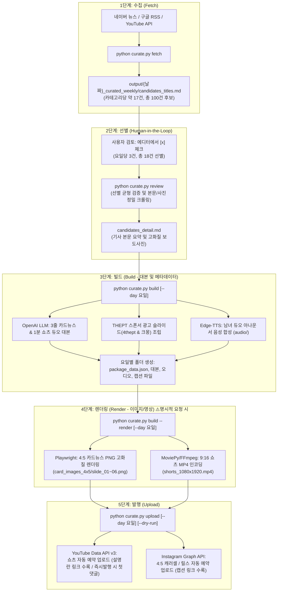

<!-- 이 문서는 THEPT 주간 물리치료 콘텐츠 자동화 파이프라인 전체 프로세스 맵 및 운영 가이드입니다. -->
<!-- 5단계 파이프라인 아키텍처, 데이터 입출력 흐름, 특정 요일 단독 실행법, AI 에이전트 지시법을 제공합니다. -->

# 🗺️ THEPT 콘텐츠 자동화 파이프라인 마스터 가이드

THEPT 주간 물리치료 뉴스 콘텐츠(4:5 카드뉴스 + 9:16 쇼츠 비디오 + SNS 캡션)의 **전체 프로세스 흐름도**, **데이터 입출력 구조**, 그리고 **특정 요일만 핀포인트로 실행하는 방법**을 총정리한 운영 문서입니다.

---

## 1. 📊 전체 파이프라인 프로세스 맵 (Architecture Diagram)



---

## 2. 📁 주간 폴더 및 산출물 데이터 구조

한 번 파이프라인이 구동되면 `output/{YYYY-MM-DD}_curated_weekly/` 아래에 요일별로 완결된 콘텐츠 패키지가 생성됩니다.

```
output/2026-09-07_curated_weekly/
├── candidates_titles.md           # [1단계] 100건 후보 기사 제목 및 [x] 체크 시트
├── candidates_detail.md           # [2단계] 선별 기사 본문 요약 및 사진 검토 시트
├── weekly_summary.md              # [결과] 주간 6일 콘텐츠 제작 상태 요약표
├── backgrounds/                   # 다운로드된 보도사진 및 테마 배경 이미지
│   ├── fri_01_article_photo.jpg
│   ├── pt_clinic_bg.jpg
│   └── ai_rehab_bg.jpg
│
├── 0907_Mon_Policy/               # 월요일(09/07): 국내 정책·제도·수가·실손보험
├── 0908_Tue_Clinical/             # 화요일(09/08): 임상 실무·질환별 재활 프로토콜
├── 0909_Wed_Sports/               # 수요일(09/09): 운동·스포츠 재활
├── 0910_Thu_Tech/                 # 목요일(09/10): 첨단 재활 기술·AI·로봇 (오늘 목요일!)
├── 0911_Fri_Celeb/                # 금요일(09/11): 셀럽 스타 치료 & 건강 가십
└── 0912_Sat_Global/               # 토요일(09/12): 해외 글로벌 트렌드 (APTA, 연구 번역)
```

### 📄 요일별 폴더 내부 파일 구성 (완전 독립 패키지)

각 요일 폴더(예: `0910_Thu_Tech`)는 외부 의존성 없이 독립적으로 업로드 및 검증이 가능합니다:

| 파일 / 디렉토리 | 내용 및 용도 |
| :--- | :--- |
| `package_data.json` | 6개 슬라이드 전체 구조, 대본 텍스트, 광고 데이터, 오디오 타임라인 통합 JSON |
| `audio/` | 슬라이드별 고속 TTS MP3 파일 (`audio_01_cover.mp3` ~ `audio_06_outro.mp3`) |
| `card_images_4x5/` | 인스타그램 피드용 4:5 고화질 PNG 이미지 (`slide_01.png` ~ `slide_06.png`) |
| `shorts_1080x1920.mp4` | 음성·배경·자막·화면전환이 완벽히 인코딩된 최대 2분 방송형 쇼츠 비디오 |
| `instagram_caption.txt` | 인스타그램 피드/릴스 발행 시 자동 입력되는 본문 캡션 및 해시태그 |
| `youtube_shorts_caption.txt`| 유튜브 쇼츠 발행 시 타임스탬프 목차, 서비스 링크, 태그가 수록된 설명문 |
| `first_comment.txt` | 출처 및 4THEPT/크몽 홍보용 댓글 텍스트 (즉시 발행 시 자동 등록 / 예약 시 설명란에 기본 포함) |
| `curation_notes.txt` | 해당 요일에 채택된 기사 원문 링크, 출처, 선택 이유 아카이브 |

> [!NOTE]
> **유튜브/인스타그램 예약 발행 시 댓글 동작 원리:**
> - **유튜브 정책**: `publishAt` 예약 시 영상은 공개 전까지 `private(비공개)` 상태로 안전하게 보관됩니다. 유튜브 공식 API 정책상 비공개 영상에는 사전 댓글 등록(`commentThreads.insert`)이 차단(403)되므로, 예약 중에는 댓글이 미리 달리지 않습니다.
> - **링크 유입 보장 (대안)**: 4THEPT 및 크몽 가이드북 바로가기 링크는 **쇼츠 설명란(더보기란 `youtube_shorts_caption.txt`) 본문에 100% 자동 수록**되므로 링크 클릭 유입에는 전혀 지장이 없습니다.
> - **즉시 공개 시**: 예약 없이 즉시 공개 업로드할 경우 영상이 바로 활성화되므로 첫 댓글이 즉시 정상 등록됩니다.
> - **상단 고정핀(Pin)**: 유튜브 API 자체에서 댓글 고정핀(Pin) API를 제공하지 않으므로, 핀 고정은 영상 공개 후 유튜브 스튜디오 앱/웹에서 터치 한 번으로 진행해야 합니다.

---

## 3. 🎯 특정 요일 핀포인트 부분 실행 치트시트

전체 6일을 무조건 처음부터 끝까지 돌릴 필요가 없습니다. **"목요일(9/10) 것만 다시 만들고 싶다"**, **"10일 것만 업로드하고 싶다"**는 경우 `--day` 옵션을 사용합니다.

### 📌 요일 키워드 입력 규칙
- **날짜 (월/일)**: `9/10`, `9-10`, `0910`, `10`, `10일` 등
- **영문 요일**: `mon`, `tue`, `wed`, `thu`, `fri`, `sat`
- **한글 요일**: `월`, `화`, `수`, `목`, `금`, `토` 또는 `월요일`, `목요일` 등
- **요일 순번**: `1` ~ `6` 또는 `01` ~ `06`
- **테마 단어**: `policy`, `clinical`, `sports`, `tech`, `youtube`, `global`

---

### 🛠️ 상황별 원클릭 명령어

#### 상황 A: 목요일 콘텐츠만 새로 빌드 (대본/음성 패키지 생성)
```bash
python curate.py build --day thu
```
> ※ 이미지/영상 인코딩 없이 OpenAI 대본, 광고 슬라이드, TTS 음성 파일만 10초 만에 생성합니다.

#### 상황 B: 목요일 카드뉴스 & 쇼츠 영상 렌더링
```bash
python curate.py build --day thu --render
```
> ※ 목요일 폴더의 카드뉴스 PNG 6장과 쇼츠 MP4 비디오 1편을 즉시 렌더링합니다.

#### 상황 C: 목요일 콘텐츠 SNS 업로드 전 시뮬레이션 (Dry-Run)
```bash
python curate.py upload --day thu --dry-run
```
> ※ 실제 API 업로드 없이 예약 시간, 캡션, 파일 경로 매핑이 올바른지 터미널에 시뮬레이션합니다.

#### 상황 D: 목요일 콘텐츠 실제 SNS 예약 업로드
```bash
python curate.py upload --day thu
```
> ※ 목요일 쇼츠 비디오(YouTube)와 카드뉴스 캐러셀(Instagram)을 목요일 오전 8시(KST)로 자동 예약합니다.

#### 상황 E: 오늘 요일에 해당하는 콘텐츠만 즉시 발행
```bash
python curate.py upload --today-only
```
> ※ 오늘(현재 KST 기준) 요일 폴더를 자동 감지하여 즉시 업로드합니다.

---

## 4. 💬 AI 에이전트(Antigravity) 자연어 대화 지시 매뉴얼

터미널 명령어를 직접 입력하지 않고, AI 채팅창에 자연어로 아래와 같이 말씀하시면 에이전트가 알아서 최적화된 명령어를 수행합니다:

| 요청 목적 | 사용자 자연어 지시 예시 | 에이전트 실행 명령어 |
| :--- | :--- | :--- |
| **주간 기사 수집** | "이번 주 기사 수집해줘" | `python curate.py fetch` |
| **선별 기사 검토** | "선별 마크다운 검토해줘" | `python curate.py review` |
| **주 6일 전체 빌드** | "선별 끝났으니 6일치 대본이랑 패키지 만들어줘" | `python curate.py build` |
| **목요일만 대본 생성** | "목요일 것만 대본이랑 오디오 다시 뽑아줘" | `python curate.py build --day thu` |
| **목요일 미디어 렌더링** | "목요일 카드뉴스랑 쇼츠 렌더링해줘" | `python curate.py build --day thu --render` |
| **전체 6일 미디어 렌더링** | "주간 6일치 전부 렌더링 돌려줘" | `python curate.py build --render` |
| **업로드 전 점검** | "목요일 업로드 잘 되는지 시뮬레이션해줘" | `python curate.py upload --day thu --dry-run` |
| **목요일 업로드 실행** | "목요일 콘텐츠 유튜브랑 인스타에 올려줘" | `python curate.py upload --day thu` |
| **오늘 요일 업로드** | "오늘 요일 것만 지금 바로 업로드해줘" | `python curate.py upload --today-only` |

---

## 5. 🔍 장애 대응 및 유지관리 도구

| 기능 | 명령어 | 설명 |
| :--- | :--- | :--- |
| **유튜브 인증 점검** | `python curate.py auth-yt` | YouTube Data API OAuth2 토큰 갱신 및 최초 1회 브라우저 로그인 |
| **인스타그램 연결 진단** | `python curate.py test-insta` | 페이스북 페이지 및 인스타그램 비즈니스 계정 권한/토큰 유효성 검사 |
| **큐레이션 누적 통계** | `python curate.py stats` | 지금까지 선별/채택된 누적 기사 수 및 선택 이유 데이터셋 통계 |
| **GitHub 미디어 동기화** | `python curate.py sync` | 렌더링된 미디어를 깃허브에 커밋/푸시하고 4주 이전 폴더 자동 정리 |
| **유튜브 토큰 추출** | `python curate.py export-yt-secrets` | GitHub Actions Secrets 등록용 YouTube 토큰 Base64 문자열 출력 |

---

## 6. ⏰ 매일 아침 08:00 GitHub Actions 무인 자동 발행

인스타그램 카드뉴스와 유튜브 쇼츠를 **매일 아침 8시(KST)에 동시 즉시 공개로 자동 발행**하고, **첫 댓글까지 자동 등록**하는 완전 무인 시스템입니다.

### 🔄 동작 메커니즘
1. 로컬에서 주간 큐레이션 및 미디어 렌더링 완료 후:
   ```bash
   python curate.py sync
   ```
   실행 시 `output/`의 미디어 파일이 GitHub 저장소로 자동 커밋·푸시됩니다. (4주 경과 미디어는 자동 정리)
2. **매일 아침 08:00 KST (UTC 23:00)**:
   - GitHub Actions (`.github/workflows/daily_sns_publish.yml`) 자동 실행
   - 저장소의 `token.pickle` 복원 후 당일 요일 폴더 자동 탐색
   - **YouTube Shorts 즉시 공개 업로드 + 첫 댓글 자동 등록**
   - **Instagram 피드 캐러셀 즉시 업로드 + 본문 캡션 등록**

